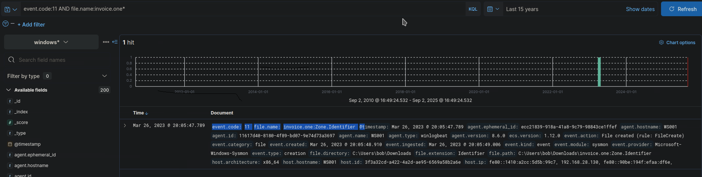
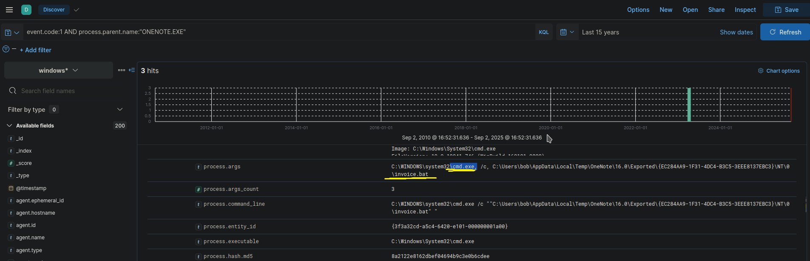
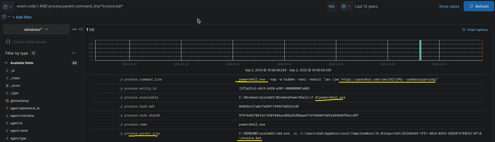
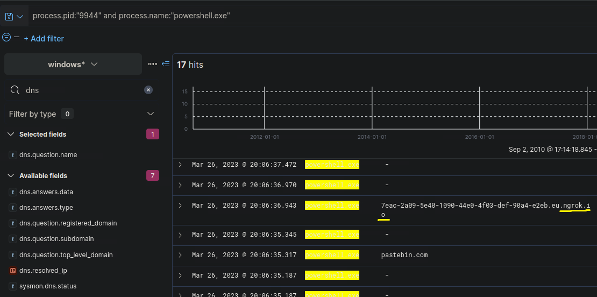
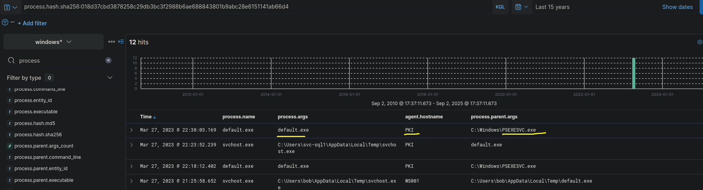
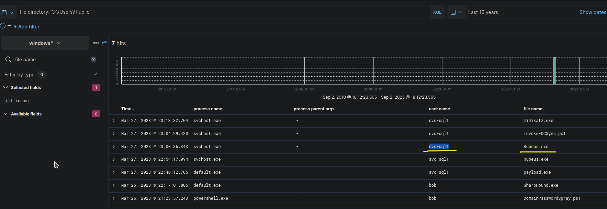
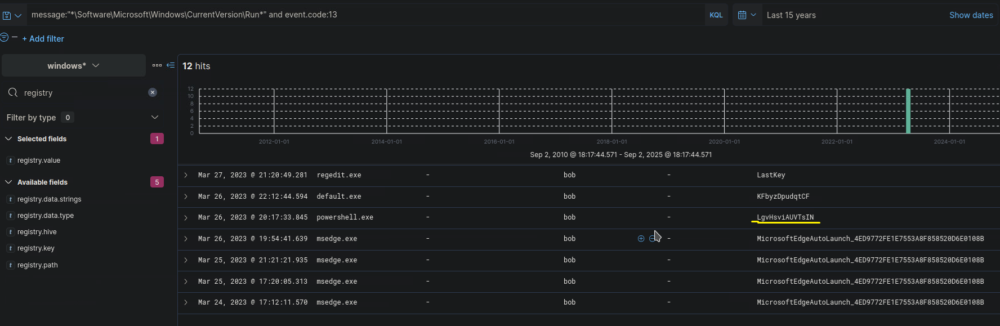
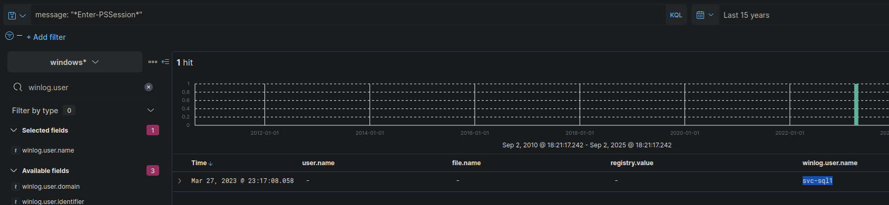

# Tracing an Intrusion: An End-to-End Threat Hunt with a SIEM

> *This writeup details my methodology for completing the "Introduction to Threat Hunting" module from Hack The Box Academy.*

## 1. The Challenge: An Overview

In this investigation, I acted as a security analyst for a simulated enterprise network. My objective was to use a SIEM (Kibana) to analyze endpoint (Sysmon) and network (Zeek) logs to determine if the network had been compromised. The goal was to trace the full attack chain by writing and executing a series of precise KQL queries.

---

## 2. Tools Used

* **SIEM**: Kibana / ELK Stack
* **Endpoint Telemetry**: Sysmon, Windows Event Logs
* **Network Telemetry**: Zeek
* **Query Language**: KQL (Kibana Query Language)

---

## 3. Investigation & Methodology

The hunt was structured to first confirm the initial compromise, then analyze the payload's actions, and finally broaden the search to identify all related adversary TTPs.

### 3.1. Initial Access & Execution

The investigation began by hunting for the primary IOC, the filename `invoice.one`. I then traced its execution flow.

```kql
event.code:11 AND file.name:invoice.one*
```



This query confirmed the file was downloaded to `WS001`. The next logical step was to see if it was executed. I hunted for any suspicious child processes created by the `ONENOTE.EXE` process.

```kql
event.code:1 AND process.parent.name:"ONENOTE.EXE"
```

The previous step revealed that `ONENOTE.EXE` launched `cmd.exe` to execute a batch file named `invoice.bat`. To complete the execution chain, my next step was to investigate what actions that batch file performed. I wrote a new query to find any child processes whose parent process command line contained `invoice.bat`.



```kql
event.code:1 AND process.parent.command_line:*invoice.bat*
```

This query revealed the malicious process chain: `ONENOTE.EXE` → `cmd.exe` → `invoice.bat` → `powershell.exe`, confirming the file was executed and launched a PowerShell downloader.



### 3.2. C2 & Lateral Movement (PsExec)

With the malicious PowerShell process identified (PID `9944`), the next step was to isolate all network activity generated by this specific process. Instead of a broad search on the host's IP, which would be noisy, I focused the investigation directly on the process ID to definitively link the execution to its network communications.

```kql
process.pid:"9944" AND process.name:"powershell.exe"
```
By enriching the results of this query with the dns.question.name field, the logs immediately revealed DNS requests to a dynamic DNS provider, `ngrok.io`. Ngrok is a legitimate tunneling service but is frequently abused by attackers to mask their C2 traffic, making this a high-confidence indicator of malicious activity.



Next, I searched for the hash of the downloaded payload (`default.exe`) across all hosts to see if the attacker had moved.

```kql
process.hash.sha256:018d37cbd3878258c29db3bc3f2988b6ae688843801b9abc28e6151141ab66d4
```
The query returned a hit on a second server, `PKI`. I examined the parent process of this event and found **`PSEXESVC.exe`**, the service executable for the legitimate tool PsExec, confirming the attacker used it to move laterally.



### 3.3. Post-Exploitation Analysis

With the attacker's primary payload (`default.exe`) identified, the next phase was to hunt for its specific actions based on the lab's objectives.

* **Payload Dropping:** I first investigated the actions of `default.exe`. By querying for all events related to this process, I discovered a file creation event for a malicious VBS script, **`XceGuhkzaTrOy.vbs`**.

    ```kql
    process.name:"default.exe" and file.extension:"vbs"
    ```

* **Credential Dumping:** Next, to hunt for credential dumping, I searched the logs for any execution of the tool **`mimikatz.exe`**. This query returned a Sysmon `Event ID 1` log where I could inspect the `process.args` field to capture the exact arguments used:

    ```kql
    process.name:"mimikatz.exe"
    ```
    The query confirmed the arguments were **`lsadump::dcsync /domain:eagle.local /all /csv`**.

* **Discovery:** Finally, to identify discovery activity, I analyzed PowerShell script block logs (`Event ID 4104`). I searched the script content for the term "mimikatz" and found a log entry explicitly attributing the malicious code to the **PowerView** framework.

    ```kql
    event.code:4104 AND powershell.script_block_text:"*mimikatz*"
    ```

### 3.4. Hunting for Additional TTPs

With the full initial compromise understood, I broadened my hunt to find other known attacker techniques from the skills assessment.

* **Lateral Tool Transfer:** I hunted for files dropped in the common staging directory `C:\Users\Public`, a known attacker TTP.
    ```kql
    file.directory:"C:\\Users\\Public"
    ```
    This query revealed the tool **`rubeus.exe`** being transferred by the user **`svc-sql1`**.

  

* **Persistence:** Citing the MITRE ATT&CK framework, I hunted for **Registry Run Key** modifications by querying for `Event ID 13` in common autostart locations.
    ```kql
    event.code:13 AND message:"*\\Software\\Microsoft\\Windows\\CurrentVersion\\Run*"
    ```
    After filtering out known good entries, the analysis identified the first malicious persistence action with the value **`LgvHsviAUVTsIN`**.

  

* **PowerShell Remoting:** I hunted for an alternative lateral movement technique by searching for the `Enter-PSSession` cmdlet, which is used to establish a PowerShell Remoting session.
    ```kql
    message:"*Enter-PSSession*"
    ```
    This query returned a single hit, confirming that the user **`svc-sql1`** performed lateral movement towards the Domain Controller.

  
---

## 4. Lessons Learned

During the 'Lateral Tool Transfer' hunt, I initially went down a rabbit hole searching for a `user.name` that started with 'r'. After my queries failed to produce the expected result, I re-read the task carefully and realized it was the **tool's name**, not the username, that was the key detail. This was a crucial lesson in the importance of precise reading of intelligence and not jumping to conclusions during an investigation.

---

## 5. Conclusion & Key Findings

This investigation successfully traced a multi-stage intrusion and identified multiple post-exploitation activities by writing specific KQL queries.

* **Initial Access & Execution**: The attacker gained entry via a malicious OneNote file.
* **Credential Access & Discovery**: The attacker used **Mimikatz** for credential dumping and **PowerView** for AD reconnaissance.
* **Lateral Movement**: The attacker used two distinct methods: **PsExec** and **PowerShell Remoting**.
* **Persistence**: The attacker established persistence using a **Registry Run Key**.
* **Tool Staging**: The attacker transferred tools, including `rubeus.exe`, into the `C:\Users\Public` directory.
