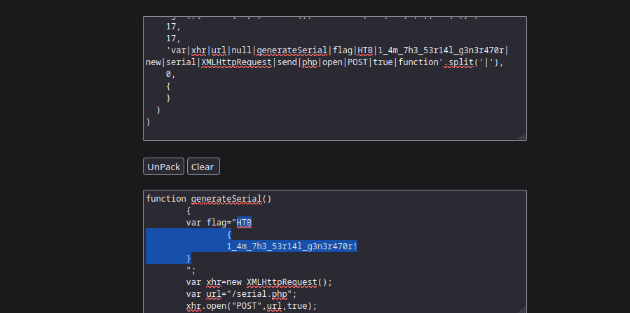
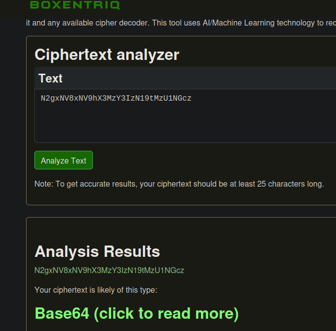

# Foundational Web Analysis: Deobfuscation, API Interrogation, & Decoding

> *This writeup details my methodology for completing the foundational sections of the "JavaScript Deobfuscation" module from Hack The Box Academy.*

## 1. The Challenge: An Overview

In this project, I completed a series of foundational exercises in client-side web analysis. The objective was to practice four key skills: analyzing source code for sensitive information, deobfuscating packed JavaScript, making HTTP requests with cURL, and decoding common web encodings.

---

## 2. Tools Used

* **Browser**: Browser Developer Tools
* **Web Tools**: Online JavaScript Unpacker, Online Cipher Identifier
* **API Interaction**: `cURL`
* **Decoding**: Linux Command Line (`base64`)

---

## 3. Investigation & Methodology

The investigation was broken into four distinct phases, each focused on a core skill.

### 3.1. Static Code Analysis

The first task was to perform basic reconnaissance on a web page. By simply viewing the HTML source code, I was able to identify sensitive information left by a developer in the comments.


*Caption: The flag found directly within the HTML source code comments.*

### 3.2. JavaScript Deobfuscation

The next challenge involved a JavaScript file (`secret.js`) that was obfuscated. Upon inspection, I identified it as being "packed," a common obfuscation technique. I copied the entire block of packed code and pasted it into a popular online JavaScript unpacker, which successfully deobfuscated the code and revealed the hidden flag.



### 3.3. API Interrogation with cURL

Analysis of the deobfuscated `secret.js` revealed it was making an empty POST request to a `/serial.php` endpoint. To investigate this, I replicated the request using `cURL` from my terminal.

```bash
curl -s http://[Target IP]:[Port]/serial.php -X POST
```
This command returned a Base64-encoded string, `N2gxNV8xNV9hX3MzY3IzN19tMzU1NGcz`, indicating the server responded with encoded data.

### 3.4. Decoding Payloads

The final step was to decode the string and use it. I first used an online cipher identifier and then the `base64` command-line utility in Linux to decode the string.



```bash
echo 'N2gxNV8xNV9hX3MzY3IzN19tMzU1NGcz' | base64 -d
```
This revealed the plaintext `7h15_15_a_s3cr37_m3554g3`. I then sent this decoded string back to the server in a new POST request, as instructed by the lab, to retrieve the final flag for this exercise.

```bash
curl -s http://[Target IP]:[Port]/serial.php -X POST -d "serial=7h15_15_a_s3cr37_m3554g3"
```
---

## 4. Conclusion & Key Findings

This project demonstrated proficiency in four foundational client-side analysis techniques.

* **Source Code Review:** Sensitive information can often be found in HTML comments.
* **Deobfuscation:** Automated tools can often reverse common JavaScript packing techniques.
* **API Interaction:** `cURL` is an essential tool for manually interacting with and testing web application endpoints.
* **Decoding:** Identifying and decoding common web encodings like Base64 is a critical skill for an analyst.

This investigation successfully answered all of the lab's core questions, culminating in the retrieval of the final flag: **`HTB{ju57_4n07h3r_r4nd0m_53r14l}`**.
