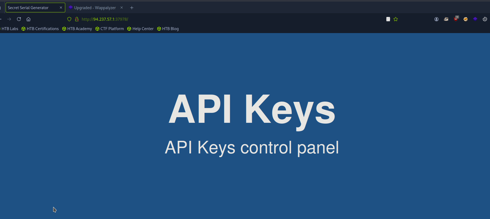
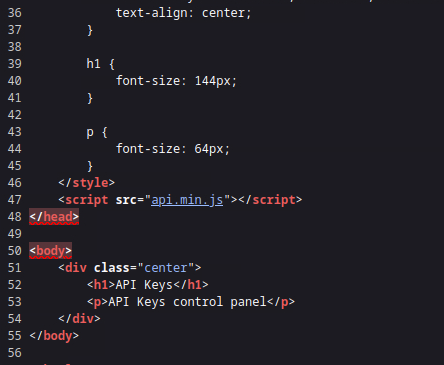
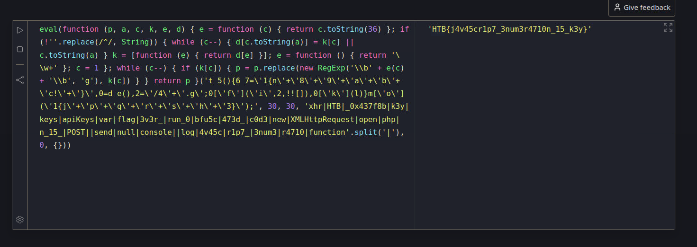
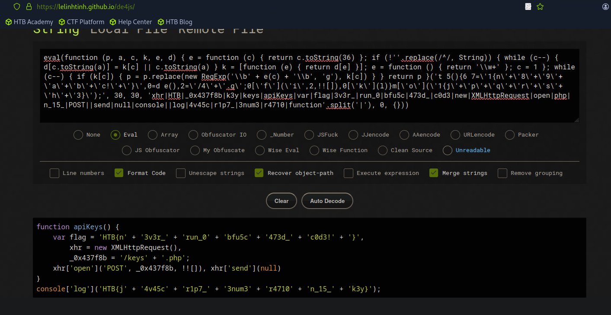
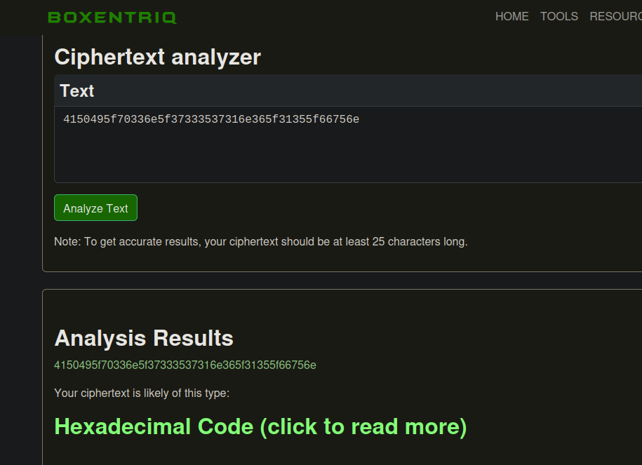
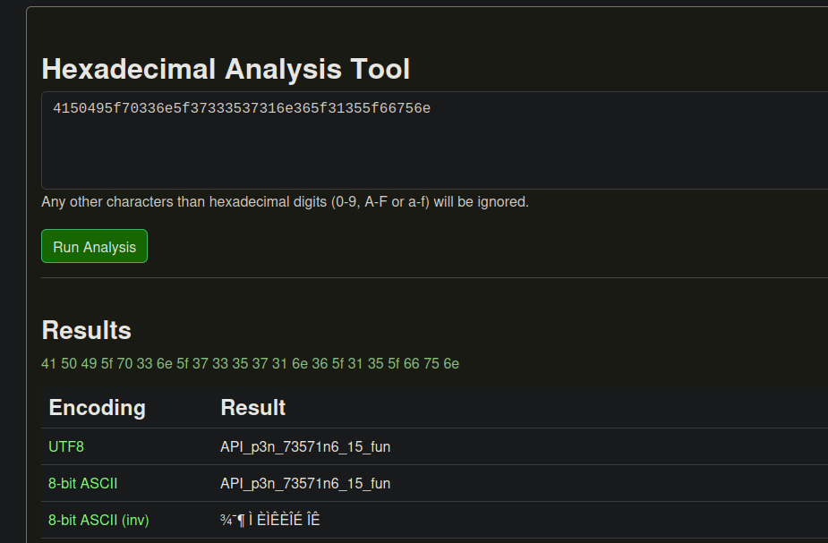

# Client-Side Teardown: A JavaScript Deobfuscation & API Hacking Case Study

> *This writeup details my methodology for completing the "Skills Assessment" section of the "JavaScript Deobfuscation" module from Hack The Box Academy.*

## 1. The Challenge: An Overview

In this capstone investigation, I was tasked with performing a multi-stage analysis of a web application's client-side code. The objective was to find and deobfuscate a hidden JavaScript file, analyze its functionality, replicate its API requests, decode its responses, and ultimately use the decoded information to retrieve a final flag from the server.

---

## 2. Tools Used

* **Browser**: Browser Developer Tools
* **Web Tools**: Online JavaScript Unpacker, Online JavaScript Playground, Online Cipher Identifier
* **API Interaction**: `cURL`
* **Decoding**: Linux Command Line (`xxd`)

---

## 3. Investigation & Methodology

The investigation followed the logical flow of a client-side web application assessment, from initial reconnaissance to final exploitation.

### 3.1. Reconnaissance & Initial Execution

The first step was to analyze the web page's source code, where I discovered a script being loaded from `api.min.js`. Before deobfuscating, I executed the raw, obfuscated code in a sandboxed online JavaScript playground, which revealed the first flag: `HTB{j4v45cr1p7_3num3r4710n_15_k3y}`.







### 3.2. Deobfuscation

Upon inspection, the code was clearly "packed." I copied the entire block of code and pasted it into an online JavaScript unpacker. The tool successfully deobfuscated the code, revealing its readable logic and a second, embedded flag variable: `HTB{n3v3r_run_0bfu5c473d_c0d3!}`.



### 3.3. API Analysis & Replication

By reading the deobfuscated JavaScript, I identified its main function: it was constructing and sending a POST request to a hidden API endpoint, `/keys.php`. To understand the API's behavior, I used `cURL` to replicate this request from my terminal.

```bash
curl -s http://[Target IP]:[Port]/keys.php -X POST
```

This command returned a long, hexadecimal string: `4150495f70336e5f37333537316e365f31355f66756e`.


### 3.4. Decoding & Final Exploitation

I used a cipher identifier to confirm the string was hexadecimal. I then used the `xxd` command-line utility in Linux to decode it.



```bash
echo '4150495f70336e5f37333537316e365f31355f66756e' | xxd -p -r
```
This revealed the plaintext secret key: `API_p3n_73571n6_15_fun`. For the final step, I sent this decoded string back to the server in a new POST request, which returned the final flag.

```bash
curl -s http://[Target IP]:[Port]/keys.php -X POST -d "key=API_p3n_73571n6_15_fun"
```



---

## 4. Lessons Learned

During the initial execution phase, I first tried to run the obfuscated JavaScript directly in my browser's developer console. This failed due to the website's security policies (Content Security Policy) blocking inline execution. This was a valuable lesson. Instead of giving up, I pivoted to using an **external, sandboxed JavaScript playground**, which successfully ran the code and revealed the first flag. It taught me that when a primary analysis method fails, it's critical to have alternative tools and environments ready.

---

## 5. Conclusion & Key Findings

This investigation successfully chained together multiple client-side analysis techniques to achieve the final objective.

* **Reconnaissance:** Found the target JavaScript file in the HTML source.
* **Deobfuscation:** Successfully reversed a common JavaScript packing technique.
* **API Analysis:** Analyzed the deobfuscated code to find and replicate a hidden API call.
* **Decoding:** Identified and decoded a hex-encoded string to reveal a secret key.

This project demonstrates a complete, end-to-end workflow for analyzing client-side code. The investigation successfully answered all of the lab's core questions, culminating in the retrieval of the final flag: **`HTB{r34dy_70_h4ck_my_w4y_1n_2_HTB}`**.
