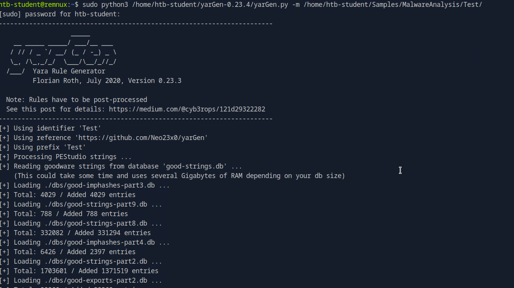

# Automating Malware Detection: Creating Yara Rules with yarGen

> *This writeup details my methodology for completing the "Creating Detection Rules" section of the "Introduction to Malware Analysis" module from Hack The Box Academy.*

## 1. The Challenge: An Overview

In this project, the objective was to move beyond manual analysis and into the realm of automated detection. The goal was to learn how to create effective **Yara** rules, a critical skill for any security analyst, defender, or threat hunter. The lab focused on using `yarGen.py`, a tool designed to automate the initial creation of Yara rules, which an analyst can then refine for precision and reliability.

---

## 2. Tools Used

* **Yara**: A tool designed to identify and classify malware samples based on textual or binary patterns. It's the "pattern matching swiss army knife for malware researchers."
* **`yarGen.py`**: An automated Yara rule generator that creates a baseline rule by extracting key strings and other metadata from a malware sample.

---

## 3. Investigation & Methodology

The process involved first practicing the rule generation workflow on a known sample (`shell.exe`) and then applying the same methodology to the target sample (`dharma_sample.exe`).

### 3.1. Phase 1: Generating a Baseline Rule for `shell.exe`

To begin, I isolated the known malware sample (`shell.exe`) in a dedicated directory to ensure `yarGen` would focus only on that file.

```bash
mkdir /home/htb-student/Samples/MalwareAnalysis/Test
cp /home/htb-student/Samples/MalwareAnalysis/shell.exe /home/htb-student/Samples/MalwareAnalysis/Test/
````

With the sample staged, I executed `yarGen.py`, pointing it to the new directory.

```bash
sudo python3 /home/htb-student/yarGen-0.23.4/yarGen.py -m /home/htb-student/Samples/MalwareAnalysis/Test/
```

This command automatically processed `shell.exe`, compared its strings against a database of known "goodware" strings, and generated a baseline Yara rule in a file named `yargen_rules.yar`.



### 3.2. Deconstructing the Auto-Generated Rule

The rule generated by `yarGen` is a powerful starting point, but as my notes indicated, it requires an analyst's review to be truly effective.

```yara
rule _home_htb_student_Samples_MalwareAnalysis_Test_shell {
   meta:
      description = "Test - file shell.exe"
      author = "yarGen Rule Generator"
      reference = "https://github.com/Neo23x0/yarGen"
      date = "2025-09-03"
      hash1 = "bd841e796feed0088ae670284ab991f212cf709f2391310a85443b2ed1312bda"
   strings:
      $x1 = "C:\\Windows\\System32\\cmd.exe" fullword ascii
      $s2 = "http://ms-windows-update.com/svchost.exe" fullword ascii
      $s3 = "C:\\Windows\\System32\\notepad.exe" fullword ascii
      $s4 = "/k ping 127.0.0.1 -n 5" fullword ascii
      $s5 = "iuqerfsodp9ifjaposdfjhgosurijfaewrwergwea.com" fullword ascii
      $s6 = "  VirtualQuery failed for %d bytes at address %p" fullword ascii
      $s7 = "[-] Error code is : %lu" fullword ascii
      $s8 = "Failed to open the registry key." fullword ascii
      $s9 = "C:\\Program Files\\VMware\\VMware Tools\\" fullword ascii
      $s10 = "  VirtualProtect failed with code 0x%x" fullword ascii
      $s11 = "Connection sent to C2" fullword ascii
      $s12 = "AWAVAUATVSH" fullword ascii
      $s13 = "VPAPAPAPI" fullword ascii
      $s14 = "  Unknown pseudo relocation protocol version %d." fullword ascii
      $s15 = "45.33.32.156" fullword ascii
      $s16 = "AQAPRQVH1" fullword ascii
      $s17 = "connect" fullword ascii /* Goodware String - occured 429 times */
      $s18 = "socket" fullword ascii /* Goodware String - occured 452 times */
      $s19 = "SOFTWARE\\VMware, Inc.\\VMware Tools" fullword ascii
      $s20 = "Sandbox detected" fullword ascii
   condition:
      uint16(0) == 0x5a4d and filesize < 60KB and
      1 of ($x*) and 4 of them
}
```

*The Yara rule for `shell.exe` as generated by `yarGen.py`.*

This rule has three main parts:

  * **`meta`**: Contains metadata like the description, author, and the sample's hash.
  * **`strings`**: Lists interesting strings found in the binary. Crucially, `yarGen` flags common "goodware" strings like `$s17` ("connect") and `$s18` ("socket"), which an analyst should consider removing to reduce false positives.
  * **`condition`**: This is the logic. Here, it requires the file to be a Windows PE file (`uint16(0) == 0x5a4d`), be smaller than 60KB, and match at least one of the "high-value" strings (`$x*`) and four of any other strings. An analyst might adjust these thresholds to make the rule more or less strict.

### 3.3. Applying the Rule: Detection with Yara

With the rule generated, I used the Yara command-line tool to scan a directory for matching files. To ensure the scan included all subdirectories, I used the **`-r` (recursive)** flag.

```bash
$ yara yargen_rules.yar -r /home/htb-student/

_home_htb_student_Samples_MalwareAnalysis_Test_shell /home/htb-student//Samples/MalwareAnalysis/Test/shell.exe
_home_htb_student_Samples_MalwareAnalysis_Test_shell /home/htb-student//Samples/MalwareAnalysis/shell.exe
```

*The Yara scan successfully identifies two instances of `shell.exe` using the auto-generated rule.*

The output correctly identified the original `shell.exe` and the copy I had placed in the `Test` directory, confirming the rule was effective.

### 3.4. Phase 2: Applying the Methodology to `dharma_sample.exe`

Following the successful practice run, I applied the exact same methodology to the target malware, `dharma_sample.exe`. I copied it to the `Test` directory and re-ran `yarGen` to generate a new set of rules that now included a signature for the Dharma sample. This completed the primary objective of the lab.

```bash
cp /home/htb-student/Samples/MalwareAnalysis/dharma_sample.exe /home/htb-student/Samples/MalwareAnalysis/Test/
sudo python3 /home/htb-student/yarGen-0.23.4/yarGen.py -m /home/htb-student/Samples/MalwareAnalysis/Test/
```
```bash
$ cat yargen_rules.yar 
/*
   YARA Rule Set
   Author: yarGen Rule Generator
   Date: 2025-09-03
   Identifier: Test
   Reference: https://github.com/Neo23x0/yarGen
*/

/* Rule Set ----------------------------------------------------------------- */

rule dharma_sample {
   meta:
      description = "Test - file dharma_sample.exe"
      author = "yarGen Rule Generator"
      reference = "https://github.com/Neo23x0/yarGen"
      date = "2025-09-03"
      hash1 = "bff6a1000a86f8edf3673d576786ec75b80bed0c458a8ca0bd52d12b74099071"
   strings:
      $x1 = "C:\\crysis\\Release\\PDB\\payload.pdb" fullword ascii
      $s2 = "sssssbsss" fullword ascii
      $s3 = "sssssbs" fullword ascii
      $s4 = "{RDqP^\\" fullword ascii
      $s5 = "QtVN$0w" fullword ascii
      $s6 = "RSDS%~m" fullword ascii
      $s7 = "u5o[\"-" fullword ascii
      $s8 = ")3ty/\\" fullword ascii
      $s9 = "j={s`t" fullword ascii
      $s10 = "9Fm*EK" fullword ascii
      $s11 = "&KP6IG" fullword ascii
      $s12 = ")$ATou" fullword ascii
      $s13 = "4xf)^d" fullword ascii
      $s14 = "==YK4\"" fullword ascii
      $s15 = "0[ :FZ" fullword ascii
      $s16 = "ipgypA" fullword ascii
      $s17 = "A!6`pT" fullword ascii
      $s18 = "%dVL>O" fullword ascii
      $s19 = "X_l){^>" fullword ascii
      $s20 = "e1w%mU" fullword ascii
   condition:
      uint16(0) == 0x5a4d and filesize < 300KB and
      1 of ($x*) and 4 of them
}

rule _home_htb_student_Samples_MalwareAnalysis_Test_shell {
   meta:
      description = "Test - file shell.exe"
      author = "yarGen Rule Generator"
      reference = "https://github.com/Neo23x0/yarGen"
      date = "2025-09-03"
      hash1 = "bd841e796feed0088ae670284ab991f212cf709f2391310a85443b2ed1312bda"
   strings:
      $x1 = "C:\\Windows\\System32\\cmd.exe" fullword ascii
      $s2 = "http://ms-windows-update.com/svchost.exe" fullword ascii
      $s3 = "C:\\Windows\\System32\\notepad.exe" fullword ascii
      $s4 = "/k ping 127.0.0.1 -n 5" fullword ascii
      $s5 = "iuqerfsodp9ifjaposdfjhgosurijfaewrwergwea.com" fullword ascii
      $s6 = "  VirtualQuery failed for %d bytes at address %p" fullword ascii
      $s7 = "[-] Error code is : %lu" fullword ascii
      $s8 = "C:\\Program Files\\VMware\\VMware Tools\\" fullword ascii
      $s9 = "Failed to open the registry key." fullword ascii
      $s10 = "Connection sent to C2" fullword ascii
      $s11 = "  VirtualProtect failed with code 0x%x" fullword ascii
      $s12 = "AWAVAUATVSH" fullword ascii
      $s13 = "VPAPAPAPI" fullword ascii
      $s14 = "  Unknown pseudo relocation protocol version %d." fullword ascii
      $s15 = "45.33.32.156" fullword ascii
      $s16 = "AQAPRQVH1" fullword ascii
      $s17 = "connect" fullword ascii /* Goodware String - occured 429 times */
      $s18 = "socket" fullword ascii /* Goodware String - occured 452 times */
      $s19 = "Windows-Update/7.6.7600.256 %s" fullword ascii
      $s20 = "1Lbcfr7sAHTD9CgdQo3HTMTkV8LK4ZnX71" fullword ascii
   condition:
      uint16(0) == 0x5a4d and filesize < 60KB and
      1 of ($x*) and 4 of them
}

/* Super Rules ------------------------------------------------------------- */

```

-----

## 4\. Conclusion & Key Takeaways

This project was a practical exercise in moving from reactive analysis to proactive detection-engineering.

  * **Automation is a Force Multiplier**: Tools like `yarGen.py` can drastically speed up the initial phase of rule creation, but they do not replace the analyst.
  * **Human Oversight is Critical**: The output of automated tools must be reviewed by an analyst to remove common strings, tune the detection logic, and reduce the potential for false positives.
  * **Effective Scanning Requires Strategy**: Understanding and using flags like `-r` (recursive) is key to deploying detection rules for broad and effective scans across a filesystem.
