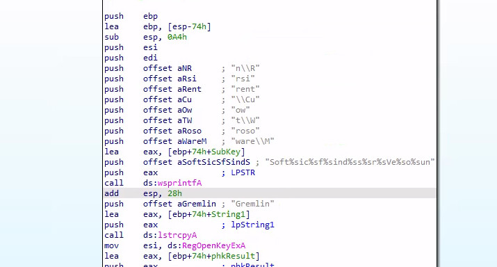
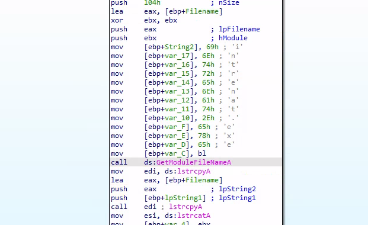

# Static Analysis of `orange.exe`

In this project, I performed a static analysis of the malware sample `orange.exe`. My objective was to reverse engineer its core functionalities without running the code, focusing on identifying persistence mechanisms and any secondary payloads.

---

## Tools Used

* **Analysis Environment**: Linux host with a Windows VM
* **Disassembler**: IDA Freeware
* **File Transfer**: Python `http.server` and `xfreerdp`

---

## Analysis Walkthrough

#### 1. Initial Setup and File Transfer

The analysis began by transferring the sample to a sandboxed Windows VM. To accomplish this, the file was hosted on my Linux machine using Python's simple `http.server`. I then used `xfreerdp` to establish a remote desktop session to the Windows analysis machine, from which I downloaded the sample for examination.

#### 2. Finding the Foothold: Hunting for Persistence

With the executable loaded into IDA Freeware, I began hunting for suspicious Windows API calls. My attention was quickly drawn to a call to `RegOpenKeyExA`, a function commonly used to modify the registry. Malware frequently abuses registry "Run keys" to ensure it automatically executes every time the computer starts.

The author of this malware attempted to hide the registry key by breaking it into several small strings and pushing them onto the stack individually before the function call.

*Caption: IDA Freeware showing the stacked strings before the `RegOpenKeyExA` call.*

By examining the stack in reverse order, I pieced the fragments together. This reconstruction revealed the full path to a common persistence location:

* **Identified Key**: `SOFTWARE\Microsoft\Windows\CurrentVersion\Run`

#### 3. Uncovering the Payload: De-obfuscating Dropped Files

With persistence established, my next step was to see if the malware dropped any other files. In the same block of code, I found a routine in the function `sub_40A7A3` that was constructing a new string.

Instead of hiding the string in one piece, the malware built it character by character. It moved the hexadecimal value for each ASCII character into memory one at a time—a technique designed to evade simple string-searching tools.

*Caption: Assembly code showing the character-by-character construction of 'intrenat.exe'.*

By translating these hex values, I was able to manually de-obfuscate the string and reveal the name of the dropped file:

* **Identified Filename**: `intrenat.exe`

---

## Conclusion & Key Findings

This static analysis successfully identified two primary functions of `orange.exe`:

* It achieves persistence by adding an entry to the `$HKCU\Software\Microsoft\Windows\CurrentVersion\Run$` registry key.
* It carries a secondary payload, `intrenat.exe`, which it likely writes to disk after execution.

This analysis directly answers the two module questions: The registry key used for persistence is **`SOFTWARE\Microsoft\Windows\CurrentVersion\Run`**, and the function containing the dropped filename is **`sub_40A7A3`**.
