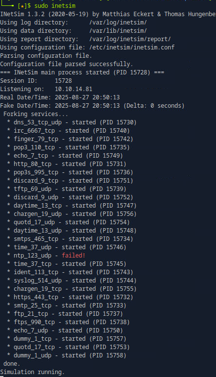
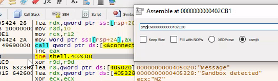
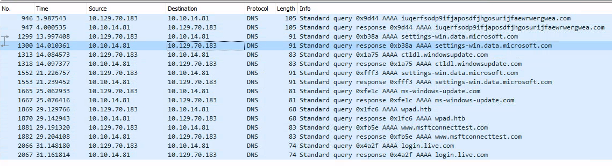
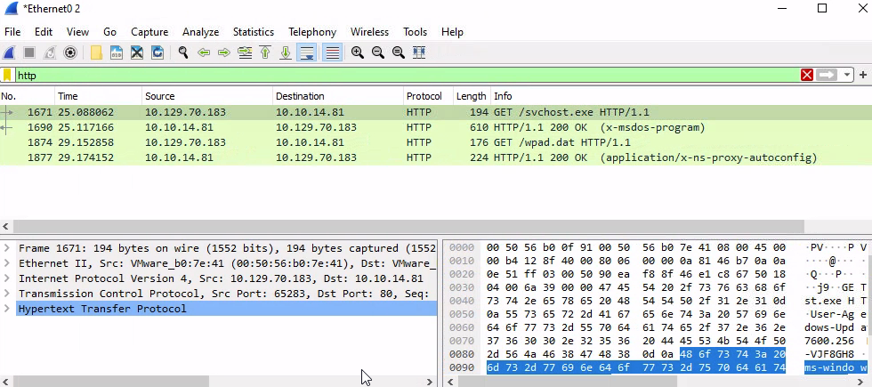
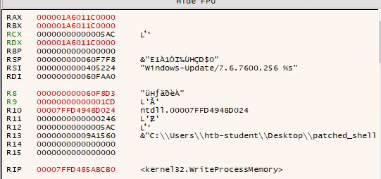

# Dynamic Analysis & Evasion: Debugging `shell.exe`

> This write-up is for the "Code Analysis" section of the "Introduction to Malware Analysis" module on Hack The Box Academy.

In this project, I performed dynamic analysis on the malware sample `shell.exe` to bypass its anti-analysis features and uncover its true payload. The objective was to debug the live process, patch its sandbox evasion checks, and intercept its network communications to understand its behavior.

---

## Tools Used

* **Debugger**: `x64dbg`
* **Network Sniffer**: `Wireshark`
* **Network Simulator**: `INetSim`
* **Analysis Environment**: Linux host with a Windows VM connected via `xfreerdp`

---

## Analysis Walkthrough

### 1. Setting Up the C2 Simulation Environment

Before debugging, it was critical to create a safe, controlled environment to intercept the malware's network traffic.

First, I configured **INetSim** on my Linux host to act as a simulated C2 server. After getting my local IP (`10.10.14.81`) with `ip a`, I modified the `inetsim.conf` file to bind all services to this address and redirect all DNS queries to a fake domain (`iuqerfsodp9ifjaposdfjhgosurijfaewrwergwea.com`). On the Windows analysis VM, I configured the DNS settings to point exclusively to the Linux host's IP, ensuring all network traffic would be funneled directly to my simulator.

*INetSim configured and running, ready to simulate internet services.*

### 2. Bypassing Sandbox Checks with `x64dbg`

With the environment ready, I loaded `shell.exe` into **`x64dbg`**. Knowing from previous analysis that the malware had anti-sandbox features, I searched for string references containing the word "sandbox." This revealed three separate detection routines that needed to be patched.

* **Check 1**: The first routine used a `cmp` instruction to check a value, which would lead to a "Sandbox Detected!" message box. By patching the instruction to compare against `0` instead of `1`, I ensured the conditional jump to the message box would never be taken.
* **Check 2**: The second check used a `je` (Jump if Equal) instruction to trigger the sandbox detection. I changed this to an unconditional `jmp` (Jump), forcing the execution flow to bypass the detection logic entirely.
* **Check 3**: The final check was similar, using a `jne` (Jump if Not Equal) instruction. I patched this to an unconditional `jmp` as well, effectively neutralizing the last anti-analysis routine.

*The third sandbox check being patched from a conditional `jne` to an unconditional `jmp` to bypass the detection logic.*

After patching all three checks, I ran the program. The INetSim default binary was downloaded, and the C2 connection appeared in the INetSim logs, confirming all sandbox checks were successfully bypassed. I then saved these changes as a new file, **`patched_shell.exe`**.

### 3. Analyzing Network Traffic with `Wireshark`

To confirm the malware's network behavior, I launched **Wireshark** to monitor the virtual network interface and then executed `patched_shell.exe`.

The Wireshark capture revealed two key activities:
1.  A DNS query for `ms-windows-update[.]com`, which was correctly resolved by INetSim to my simulated server IP (`10.10.14.81`).
2.  An HTTP GET request for `/svchost.exe`, which resulted in the download of the INetSim default executable.

*Wireshark reveals the DNS query for a fake update site and the subsequent HTTP request for a payload.*

### 4. Uncovering the Hidden Shellcode via Process Injection

The final stage of the analysis was to investigate the malware's process injection capabilities. In `x64dbg`, I set breakpoints on several key Windows API functions known for process injection: `VirtualAllocEx`, `WriteProcessMemory`, and `CreateRemoteThread`.

Upon running `patched_shell.exe`, the program launched a new, legitimate `notepad.exe` process and then hit the breakpoint for **`WriteProcessMemory`**. At this point, the malware had allocated memory in `notepad.exe` but had not yet written its malicious shellcode.

In a new `x64dbg` instance, I attached to the newly created `notepad.exe` process. The `WriteProcessMemory` function's second parameter, `lpBaseAddress` (held in the `rdx` register), points to the memory location where the shellcode will be written.

* I copied the value of the `rdx` register (`000001A6011C0000`) from the first debugger.
* In the second debugger (attached to Notepad), I navigated to this memory address in the dump.

This revealed the hidden shellcode that the malware intended to inject and execute within the context of the legitimate Notepad process.

*Caption: The hex dump from Notepad's memory at the address provided by `WriteProcessMemory`, revealing the malicious shellcode.*

---

## Conclusion & Key Findings

This dynamic analysis successfully reverse-engineered the behavior of `shell.exe`:

* **Evasion**: The malware employs at least three distinct checks to detect if it is running in a sandbox, which were bypassed by patching conditional jumps.
* **C2 Communication**: It communicates with a C2 server (disguised as a Windows Update domain) to download a secondary payload.
* **Process Injection**: It uses a classic process injection technique (`WriteProcessMemory`) to hide its final shellcode within a legitimate process (`notepad.exe`) to evade detection.

This project demonstrates a complete workflow for debugging evasive malware, from environment setup and live patching to network analysis and uncovering hidden payloads. The final hidden shellcode found was **`FC4883E4F0E8C0000000415141`**.
